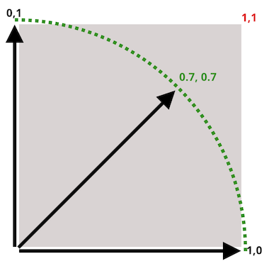

# Vector Math

Vector Math helpt je om makkelijker te werken met hoeken en richtingen waarin je sprites moeten bewegen. Een Vector is een object met een **x en y** waarde, in **PixiJS** is dat een `PIXI.Point`.

Om met vector math te werken moet je Pixi Math installeren:

```bash
npm install @pixi/math
npm install @pixi/math-extras
```

Nu kan je een Point aanmaken:

```typescript
import '@pixi/math-extras'

let targetPosition = new PIXI.Point(100,200)
```


<br>
<br>
<br>

## Snelheid als vector

Je kan de `x,y` snelheid van een sprite opslaan als vector. Hier beweeg je elk frame 1 pixel naar rechts en 1 pixel omlaag:

```typescript
this.fishSpeed = new PIXI.Point(1,1)
```
In de update tel je de `speed` vector op bij de positie. (*Let op dat we hier de `position` property van een sprite gebruiken om de `x,y` positie te bepalen*)

```typescript
export class EvilFish extends PIXI.Sprite {

    swimSpeed : PIXI.Point

    constructor(texture:PIXI.Texture) {
        super(texture)
        this.swimSpeed = new PIXI.Point(1, 1)
        this.position.set(800,400)
    }

    update(delta: number) {
        this.position = this.position.add(this.swimSpeed) as ObservablePoint  
    }
}
```
> ⚠️ de toevoeging `as ObervablePoint` is een typescript eigenaardigheid 😿 

<br>
<Br>
<br>

## Normalize

In deze afbeelding zie je dat een snelheid van `1,1` eigenlijk sneller is dan een snelheid van `1,0` of een snelheid van `0,1` (*je legt een grotere afstand af in dezelfde tijd als je snelheid 1,1 is*). 



Om dit te corrigeren kan je de `normalize()` functie gebruiken.

```typescript
const direction = new PIXI.Point(1,1)
const speed = direction.normalize() // 0.7, 0.7
this.position = this.position.add(speed) as ObservablePoint 
```

<br>
<br>
<br>

## Naar een doel bewegen

Als je weet naar welk punt je toe wil bewegen, dan kan je met `normalize()` dat `x,y` **doel** vertalen naar een `x,y` **richting**. 

⚠️ Je gebruikt daarvoor het **verschil** tussen je eigen positie en de doel positie!

```typescript
const difference = targetposition.subtract(this.position)
const speed = difference.normalize()
```

In dit voorbeeld bewegen we langzaam richting de muispointer.

```typescript
export class EvilFish extends PIXI.Sprite {

    swimSpeed:PIXI.Point

    constructor(texture) {
        super(texture)
        this.anchor.set(0.5)   
        this.swimSpeed = new PIXI.Point(-1, -1)
        this.position.set(800,400)
    }

    update(delta: number) {
        const mouseposition : PIXI.Point = this.game.pixi.renderer.plugins.interaction.mouse.global
        const speed = mouseposition.subtract(this.position).normalize()
        this.position = this.position.add(speed) as ObservablePoint
    }
}
```
<br>
<br>
<br>

## Naar het doel draaien

Om de sprite naar het doel te laten kijken hebben we een `rotation angle` nodig.

```typescript
this.angle = Math.atan2(newDirection.y, newDirection.x) * 180 / Math.PI
```

<br>
<br>
<br>

## Speed

Als je wat sneller wil gaan dan een snelheid tussen 0 en 1, kan je de richting weer vermenigvulden met een waarde:

```typescript
const difference = targetposition.subtract(this.position)
const direction = difference.normalize()
const speed = direction.multiplyScalar(3)
this.position = this.position.add(speed) as ObservablePoint
```
<br>
<br>
<br>


## Afstand tussen twee punten

Het verschil tussen twee `x,y` punten kan je opvragen met `subtract()`. Via `magnitude()` kan je de daadwerkelijke afstand in pixels tussen die punten opvragen:

```typescript
const difference = this.swimTarget.subtract(this.swimPosition)
const distance = difference.magnitude()
```


<br>
<br>
<br>

## Links

- [Point API](https://pixijs.download/release/docs/PIXI.Point.html)
- [Math plugin](https://api.pixijs.io/@pixi/math.html) en [extras](https://www.runpkg.com/?@pixi/math-extras@6.3.0/README.md)