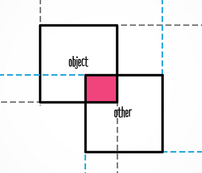

# Collision

Om te testen of twee sprites (rechthoeken) elkaar overlappen kan je de `getBounds()` functie van een sprite gebruiken. 



In dit geval zijn er twee sprites, `blockOne` en `blockTwo`.

```typescript
export class Game {

    blockOne:PIXI.Sprite
    blockTwo:PIXI.Sprite

    doneLoading(){
        this.blockOne = new PIXI.Sprite(texture)
        this.blockTwo = new PIXI.Sprite(texture)
    }

    update(delta:number) {
        this.blockOne.update()
        this.blockTwo.update()

        if(this.collision(this.blockOne, this.blockTwo)){
            console.log("the blocks touch each other ❤️")
        }
    }

    collision(blockOne:PIXI.Sprite, blockTwo:PIXI.Sprite) {
        const bounds1 = blockOne.getBounds()
        const bounds2 = blockTwo.getBounds()

        return bounds1.x < bounds2.x + bounds2.width
            && bounds1.x + bounds1.width > bounds2.x
            && bounds1.y < bounds2.y + bounds2.height
            && bounds1.y + bounds1.height > bounds2.y;
    }
}

```
> ⚠️ Dit voorbeeld toont niet het aanmaken van het pixi canvas of het laden van de textures. Zie daarvoor de [default game class](../week2/week2-pixi-game.md).

<br>
<br>
<Br>

## Hitbox

[Lees meer over collisions in de **hitbox** tutorial!](./hitbox.md)


<br>
<br>
<br>

## Links

- [MDN Tutorial 2D Collision Detection](https://developer.mozilla.org/en-US/docs/Games/Techniques/2D_collision_detection)
- [Using Physics for Collision Detection](https://brm.io/matter-js/) en [Voorbeeld Project](https://github.com/KokoDoko/piximatters)