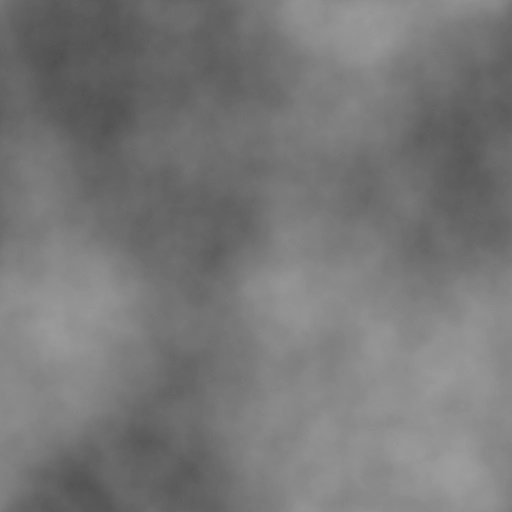

# Filters

In WebGL kan je gebruik maken van Shaders, in PixiJS heten dit Filters: https://pixijs.download/v6.1.0/docs/PIXI.filters.html

<br>
<br>
<br>

## ColorMatrix

[In deze demo](https://www.goodboydigital.com/pixijs/colorMatrix/) zie je alle mogelijkheden van het PixiJS ColorMatrix Filter! Hieronder een code voorbeeld om de `hue` van een sprite te veranderen.

```typescript
const myfilter = new PIXI.filters.ColorMatrixFilter()
this.filters = [myfilter]
myfilter.hue(Math.random()*360, false) // HUE filter
```
<br>
<br>
<br>

## Displacement Filter

Hiermee verplaats je pixels in je afbeelding, gebaseerd op de helderheid van pixels in een tweede afbeelding. [Zie dit youtube filmpje](https://www.youtube.com/watch?v=EgzL3fJxgnE). Die tweede afbeelding zou er zo uit kunnen zien:



In onderstaand code voorbeeld wordt hiermee een displacement sprite aangemaakt. Deze sprite wordt de basis voor het filter. Vervolgens verplaats je elk frame de sprite, zodat het filter ook gaat bewegen.

```typescript
import dispImage from "./images/displacement_map.jpg"

export class Game {

    displacementSprite:PIXI.Sprite

    constructor() {
        // add the displacement image to the loader!
        this.pixi.loader.add("dispTexture", dispImage)
    }

    doneLoading(){        
        // water displacement sprite
        this.displacementSprite = PIXI.Sprite.from(this.pixi.loader.resources["dispTexture"].texture!)
        this.displacementSprite.texture.baseTexture.wrapMode = PIXI.WRAP_MODES.REPEAT
        // water displacement filter
        const displacementFilter = new PIXI.filters.DisplacementFilter(this.displacementSprite)
        this.pixi.stage.addChild(this.displacementSprite)
        this.pixi.stage.filters = [displacementFilter]
        displacementFilter.scale.x = 30
        displacementFilter.scale.y = 60

        this.pixi.ticker.add((delta) => this.update(delta))
    }

    update(delta:number) {
        this.displacementSprite.x+=3
        if (this.displacementSprite.x > this.displacementSprite.width) { 
            this.displacementSprite.x = 0 
        }
    }
}
```

<br>
<br>
<br>

## Links

- [Color Matrix Demo](https://www.goodboydigital.com/pixijs/colorMatrix/)
- [Pixi Filters Documentatie](https://pixijs.download/v6.1.0/docs/PIXI.filters.html)
- [Pixi ColorMatrix Code voorbeeld](https://pixijs.io/examples/#/filters-basic/color-matrix.js)
- [Displacement Map Youtube filmpje](https://www.youtube.com/watch?v=EgzL3fJxgnE) en [code voorbeeld](https://pixijs.io/examples/#/filters-basic/displacement-map-flag.js)
