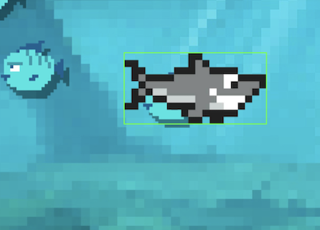
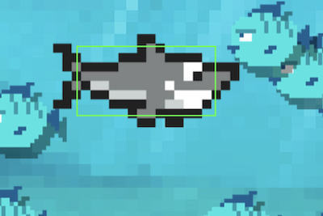

# Hitbox



In de [collision](./collision.md) tutorial heb je gezien dat je met `sprite.getBounds()` de collision rectangle kan ophalen van een sprite.

Je kan met [Pixi Graphics](https://pixijs.io/examples/#/graphics/simple.js) die hitbox ook tekenen in je sprite. [*Maak wel eerst een `class` van je sprite*](./pixi-oop.md).

In dit voorbeeld tekenen we de hitbox over de sprite heen. *We zetten hier het `pivot` punt van de sprite in het midden, zodat het texture en de green box graphic hetzelfde nulpunt hebben*.

```typescript
import * as PIXI from "pixi.js"

export class Shark extends PIXI.Sprite {

    constructor(texture:PIXI.Texture) {
        super(texture)
        this.pivot.set(0.5)

        // teken een groene box
        let area = this.getBounds()
        let greenBox = new PIXI.Graphics()
        greenBox.lineStyle(2, 0x33FF33, 1)
        greenBox.drawRect(0, 0, area.width, area.height)
        this.addChild(greenBox)
    }
}
```

<br>
<br>
<br>

## Custom hitbox



Soms wil je dat je hitbox kleiner of groter is dan de texture van je sprite. In dit voorbeeld gebruiken we een *custom rectangle* als hitbox. We passen ook de `getBounds()` functie aan zodat die onze custom hitbox gaat gebruiken.

```typescript
class Shark extends PIXI.Sprite {

    hitbox:PIXI.Rectangle

    constructor(texture){
        super(texture)
        this.pivot.set(0.5)

        // de hitbox is 130 x 55 op positie 40, 40
        this.hitbox = new PIXI.Rectangle(40, 40, 190, 55)

        // teken de hitbox
        let greenBox = new PIXI.Graphics()
        greenBox.lineStyle(2, 0x33FF33, 1)
        greenBox.drawRect(this.hitbox.x, this.hitbox.y, this.hitbox.width, this.hitbox.height)
        this.addChild(greenBox)
    }

    // getbounds geeft de hitbox terug in plaats van de sprite bounds
    getBounds() : PIXI.Rectangle {
        return new PIXI.Rectangle(this.x + this.hitbox.x, this.y + this.hitbox.y, this.hitbox.width, this.hitbox.height)
    }
}
```

> ⚠️ Je hoeft de custom hitbox niet te tekenen! Je zou hier een debug setting van kunnen maken.

<br>
<br>
<br>

## HitArea

De [hitArea](https://pixijs.download/dev/docs/PIXI.Sprite.html#hitArea) van een sprite kan je gebruiken om de hitbox voor ***mouse interaction*** aan te passen.

```typescript
this.hitArea = new PIXI.Rectangle(0,0,200,100)
```

Je kan de `hitArea` een custom shape geven met [deze plugin](https://www.npmjs.com/package/hitarea-shapes). Als een sprite geen `hitArea` heeft, dan wordt `getBounds()` gebruikt om te zien of de muis de sprite raakt.

<br>
<br>
<br>

## Links

- [getBounds API](https://pixijs.download/dev/docs/PIXI.Sprite.html#getBounds) 