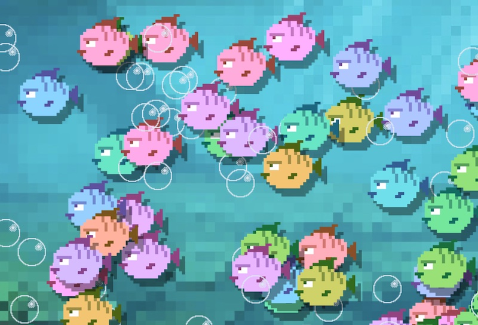

# Week 1 - PixiJS basics

Op deze pagina vind je de setup van PixiJS met een `canvas` en een `sprite`. Op de [PixiJS site](https://pixijs.io/examples/) vind je nog veel meer voorbeelden! 

<br>
<br>
<br>

## Canvas

Je maakt één keer een Pixi App aan. Hiermee plaats je een `canvas` element in je HTML pagina. In dit canvas worden alle pixi sprites en animaties getekend! 

> ⚠️ Let dus op dat je niet telkens een nieuw canvas aanmaakt als je meerdere voorbeelden gaat combineren.

```javascript
import * as PIXI from 'pixi.js'

const pixi = new PIXI.Application({ backgroundColor: 0x1099bb, width: 900, height: 500 })
document.body.appendChild(pixi.view)
```

<br>
<br>
<br>

## Preloader

We gebruiken `import` en de `pixi loader` om alle plaatjes die we nodig hebben in te laden voordat de game start.

```typescript
import fishImage from "./images/fish.png"
import bubbleImage from "./images/bubble.png"

const loader = new PIXI.Loader()
loader.add('fishTexture', fishImage)
      .add('bubbleTexture', bubbleImage)
loader.load(()=>loadCompleted())

function loadCompleted(){
    console.log("alle plaatjes zijn geladen!")
}
```
<br>
<br>
<br>

## 🐰 Sprite  

Als de preloader klaar is kan je ***sprites*** aanmaken en op het `canvas` plaatsen. Je kan dezelfde afbeelding gebruiken om meerdere ***sprites*** aan te maken.

```typescript
function loadCompleted() {
    let fish = new PIXI.Sprite(loader.resources["fishTexture"].texture!)
    fish.x = 100
    fish.y = 200
    pixi.stage.addChild(fish)

    let anotherFish = new PIXI.Sprite(loader.resources["fishTexture"].texture!)
    anotherFish.x = 400
    anotherFish.y = 100
    pixi.stage.addChild(anotherFish)
}
```
Bekijk hier alle eigenschappen van een [sprite](https://pixijs.download/dev/docs/PIXI.Sprite.html) en de [voorbeeldcode](https://pixijs.io/examples/#/sprite/basic.js)

<br>
<br>
<br>

## ⏱ Animatie

Als je een `pixi` app hebt gemaakt, kan je de `ticker` functie gebruiken om 60 keer per seconde een animatie frame te tekenen. 

Omdat de `fish` variabele in meerdere functies beschikbaar moet zijn maken we die global.

```javascript

let fish : PIXI.Sprite

function loadCompleted() {
    fish = new PIXI.Sprite(loader.resources["fishTexture"].texture!)
    pixi.ticker.add((delta) => update(delta))
}

function update(delta:number) {
    fish.x += 0.1 * delta
}
```

<br>
<br>
<br>

## 💬 Text

Kijk of je een score in beeld kan tonen!

```javascript
const basicText = new PIXI.Text(`Score: 0 Lives: 3`)
basicText.x = 50
basicText.y = 100

pixi.stage.addChild(basicText)
```
- [Text Documentatie](https://pixijs.io/examples/#/text/text.js)
- [Text style editor](https://pixijs.io/pixi-text-style/)

<br>
<br>
<br>

## 🖌 Graphics

Je kan in een HTML canvas ook [vrij tekenen](https://pixijs.io/examples/#/graphics/simple.js). Kijk of je zelf wat vormen kan tekenen:

```typescript
const graphics = new PIXI.Graphics()

graphics.beginFill(0xDE3249)
graphics.drawRect(50, 50, 100, 100)
graphics.endFill()

pixi.stage.addChild(graphics)
```
- [Graphics documentatie](https://pixijs.io/examples/#/graphics/simple.js)

<br>
<br>
<br>

# Opdracht

Maak een aquarium met vissen en bubbles zoals in deze afbeelding. *Je hoeft geen animatie te maken*.



- Je kan een `for` loop en `Math.random()` gebruiken om meerdere vissen op random posities te plaatsen.
- Je kan `sprite.tint = Math.random() * 0xFFFFFF;` gebruiken voor een random kleur.

<br>
<br>
<br>

## Links

- [📺 Kennisclip: objecten in OOP](https://youtu.be/FqDhRc4eX40)
- [Sprite Voorbeeld](https://pixijs.io/examples/#/sprite/basic.js)
- [Sprite API](https://pixijs.download/dev/docs/PIXI.Sprite.html)
