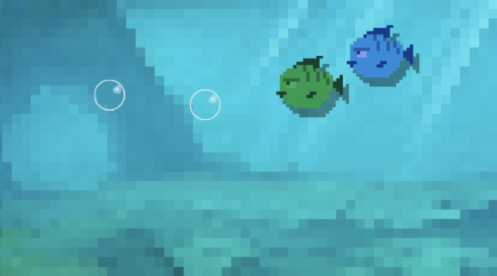

# Week 2 - Game Class

Op de [PixiJS site](https://pixijs.io/examples/) vind je veel voorbeelden voor het werken met Pixi. De minimum code voor een PIXI app is:

```javascript
const app = new PIXI.Application({ width: 900, height : 450 })
document.body.appendChild(app.view)

app.ticker.add((delta) => {
    console.log("animating....")
})
```
<br>
<br>
<br>

# Werken met classes

In OOP werken we met classes. Een class is een blokje code met specifieke eigenschappen en gedrag. De ***variabelen*** waar je mee wil werken worden ***properties*** van de class. De ***functions*** waar je mee wil werken schrijf je zonder het `function` keyword.

```typescript
class Game {
    score = 1
    startGame() {
        console.log("starting the game")
    }
}
```
> Zodra er een Game class is kan je je game aanmaken met `new Game()`!

<br>
<br>
<br>

## 🤔 Constructor en THIS keyword

De constructor is een functie die automatisch uitgevoerd wordt als er een `new` game wordt aangemaakt. De eigenschappen en functies van de `Game` class kan je aanroepen via het `this` keyword.

```typescript
class Game {
    score = 1
    constructor() {
        this.score = 4
        this.showScore()
    }
    showScore() {
        console.log(this.score)
    }
}
```


<br>
<br>
<br>

# 🕹 Pixi Game Class

We maken één `Game` class waarin we de Pixi basics aanmaken. Hierin laden we alle textures voor de hele game, en daarna starten we de game loop.

```typescript
import * as PIXI from "pixi.js"
import fishImage from "../images/fish.png"
import bgImage from "../images/background.png"

export class Game {

    pixi: PIXI.Application
    loader : PIXI.Loader

    constructor() {
        this.pixi = new PIXI.Application({ width: 900, height: 500 })
        document.body.appendChild(this.pixi.view)

        this.loader = new PIXI.Loader()
        this.loader
            .add("fishTexture", fishImage)
            .add("backgroundTexture", bgImage)

        this.loader.load(() => this.doneLoading())
    }

    doneLoading() {
        console.log("all textures loaded!")
        this.pixi.ticker.add((delta) => this.update(delta))
    }

    update(delta : number) {
        console.log(`Dit is de Game Loop!`)
    }
}

new Game()
```
De `update(delta)` functie is de ***main game loop*** van onze game. Deze wordt 60 keer per seconde aangeroepen. Omdat we met ***Typescript*** werken moet je aangeven dat `delta` een `number` is.

<br>
<br>
<br>

# 🐠 Sprites  

In [week 1 hebben we sprites getekend in het canvas](../week1/week1-pixi.md). We gaan deze code nu in `Game.ts` plaatsen. Dit doen we in `doneLoading` omdat we dan zeker weten dat alle plaatjes geladen zijn.

```typescript
export class Game {

    pixi: PIXI.Application
    fish:PIXI.Sprite
    anotherFish:PIXI.Sprite
    loader:PIXI.Loader

    constructor() {
        // zie voorbeeld hierboven
    }

    doneLoading() {
        console.log("all textures loaded!")

        this.fish = new PIXI.Sprite(this.loader.resources["fishTexture"].texture!)
        this.pixi.stage.addChild(this.fish)

        this.anotherFish = new PIXI.Sprite(this.loader.resources["fishTexture"].texture!)
        this.pixi.stage.addChild(this.anotherFish)

        this.pixi.ticker.add((delta) => this.update(delta))
    }

    update(delta : number) {
        this.fish.x -= 2
        this.anotherFish.x -= 3
    }
}
```
<Br>
<br>
<br>

# Opdracht



Plaats ***twee vissen, twee bubbles en één achtergrond afbeelding*** in de game class. 

- Je kan `Math.random()` gebruiken om de start `x,y` posities van de vissen en bubbles random te maken.
- Laat de vissen naar links bewegen en de bubbles naar boven.
- Je kan `sprite.tint = Math.random() * 0xFFFFFF;` gebruiken voor een random kleur van de vis.
- Een mooiere manier om een sprite een random kleur te geven is met een `filter`:

```typescript
const myfilter = new PIXI.filters.ColorMatrixFilter()
mysprite.filters = [myfilter]
myfilter.hue(Math.random()*360, false) // HUE filter
```

<Br>
<br>
<br>

# Opdracht

Als de vissen links uit beeld zwemmen, moeten ze rechts weer in beeld verschijnen. Als de bubbles boven uit beeld verdwijnen, moeten ze onderin beeld weer verschijnen.

<br>
<br>
<br>

# Opdracht

[Ga verder met deel 2: een array van sprites](./week2-pixi-sprites.md)

<br>
<br>
<br>


## Links

- [📺 Classes in OOP](https://youtu.be/TcYRLGJQgMI)
- [Color Filter](https://pixijs.download/v6.1.0/docs/PIXI.filters.ColorMatrixFilter.html)