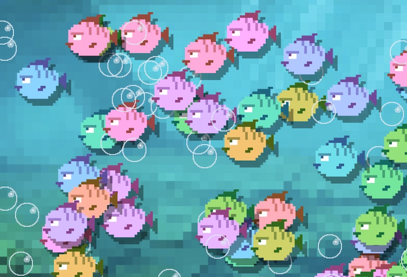

# Week 2 - Game Class

Op de [PixiJS site](https://pixijs.io/examples/) vind je veel voorbeelden voor het werken met Pixi. De minimum code voor een PIXI app is:

```javascript
const app = new PIXI.Application({ width: 900, height : 450 })
document.body.appendChild(app.view)

app.ticker.add((delta) => {
    console.log("animating....")
})
```
<br>
<br>
<br>
<br>

# 🕹 Game Class

In een OOP game hebben we altijd één `Game` class waarin we de Pixi basics aanmaken: 

```typescript
import * as PIXI from "pixi.js"

export class Game {

    pixi: PIXI.Application

    constructor() {
        const container = document.getElementById("container")!
        this.pixi = new PIXI.Application({ width: 900, height: 500 })
        container.appendChild(this.pixi.view)
        this.pixi.ticker.add((delta) => this.update(delta))
    }

    update(delta) {
        console.log(`Dit is de Game Loop!`)
    }
}

new Game()
```
## Game loop

De `update(delta)` functie is de ***main game loop*** van onze game. Deze wordt 60 keer per seconde aangeroepen. 

<br>
<br>
<br>

# 🐠 Sprite voorbeeld  

We gaan het [sprite voorbeeld](https://pixijs.io/examples/#/sprite/basic.js) in de `Game` class plaatsen!

```typescript
import * as PIXI from "pixi.js"
import { fishImage } from "./images/fish.png"

export class Game {

    pixi: PIXI.Application
    // property aanmaken voor een sprite
    sprite:PIXI.Sprite

    constructor() {
        const container = document.getElementById("container")!
        this.pixi = new PIXI.Application({ width: 900, height: 500 })
        container.appendChild(this.pixi.view)
        this.pixi.ticker.add((delta) => this.update(delta))

        // sprite aanmaken
        this.sprite = PIXI.Sprite.from(fishImage)
        this.sprite.anchor.set(0.5)
        this.sprite.x = game.pixi.screen.width / 2
        this.sprite.y = game.pixi.screen.height / 2
        this.pixi.stage.addChild(this.sprite)
    }

    update(delta) {
        // sprite animatie 60fps
        this.sprite.rotation += 0.1 * delta
    }
}
```
<Br>
<br>
<br>

# Opdracht

Plaats ***vier vissen, vier bubbles en één achtergrond afbeelding*** in de game class. 

- Je kan `Math.random()` gebruiken om de x en y posities random te maken.
- Je kan `sprite.tint = Math.random() * 0xFFFFFF;` gebruiken voor een random kleur.
- Kan je de vissen en bubbles laten bewegen?

<br>
<br>
<br>

# Opdracht



Als je voor elke sprite een property aanmaakt, dan wordt het snel onhandig om heel veel sprites te hebben. Daarom maken we de sprite property een array. Let op dat de property nu `sprites` heet.

```javascript
class Game {
    sprites : PIXI.Sprite[] = []
}
```
Gebruik nu een `for` loop in de `constructor` om meerdere sprites tegelijk aan te maken. Gebruik `this.sprites.push(...)` om de sprite in de array te zetten.

In de `update` functie kan je door je array heen loopen, om elke sprite te verplaatsen:

```javascript
class Game {
    update(delta) {
        for(let sprite of this.sprites){
            sprite.x += 1 * delta
        }
    }
}
```

Maak de afbeelding na met animerende bubbles en sprites. Kan je de bubbles omhoog laten bewegen en de fishes naar links?

<br>
<br>
<br>

# Opdracht

Als het je is gelukt om sprites te tonen in de Game class, dan kan je met behulp van de PixiJS voorbeelden ook een Tekst en een Graphic in je Game class plaatsen. 

- [PixiJS Text](https://pixijs.io/examples/#/text/text.js)
- [PixiJS Graphic](https://pixijs.io/examples/#/graphics/simple.js)